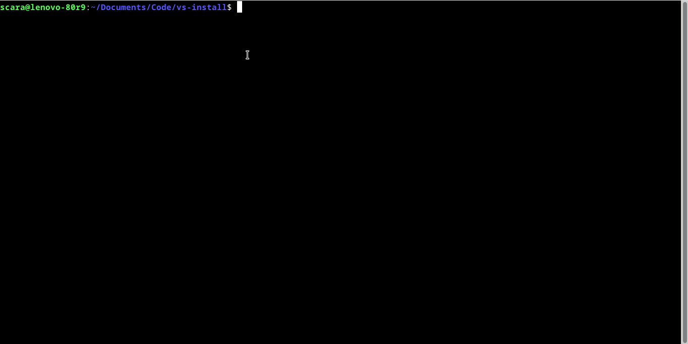

# Visual Studio Code Installer for Debian/Ubuntu


Install VS Code Easily by cloning this repo

Badges

[](https://github.com/SUFandom/vs-install) [](https://github.com/SUFandom/vs-install) 

---

[Check Microsoft's VS Code License](https://code.visualstudio.com/license?lang=en)

[Check Security.md for Sudo Password Handling session](Security.md)

**VS-Install's Purpose is to make VS Code Install Easy and only in terminal session**

<!--  -->

Video:

<video src="https://github.com/SUFandom/vs-install/raw/main/img/2024-08-23%2016-04-47.mp4" controls></video>

*if you can't see the video, please click [this](img/2024-08-23%2016-04-47.mp4) instead*

And no browser is required, just:

```

# Clone the Repo

$ git clone https://github.com/SUFandom/vs-install

# CD and Run

$ cd vs-install

$ chmod +x *.sh && ./main.sh 

```

and there you go!

## Issues

- The Current issue of this repo is that, this only works on Linux Debian/Ubuntu and only supports amd64/x86_64 at the moment

- The Script Brodcast some Error even tho the Sudo password was right
